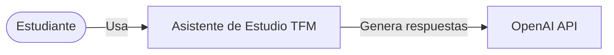
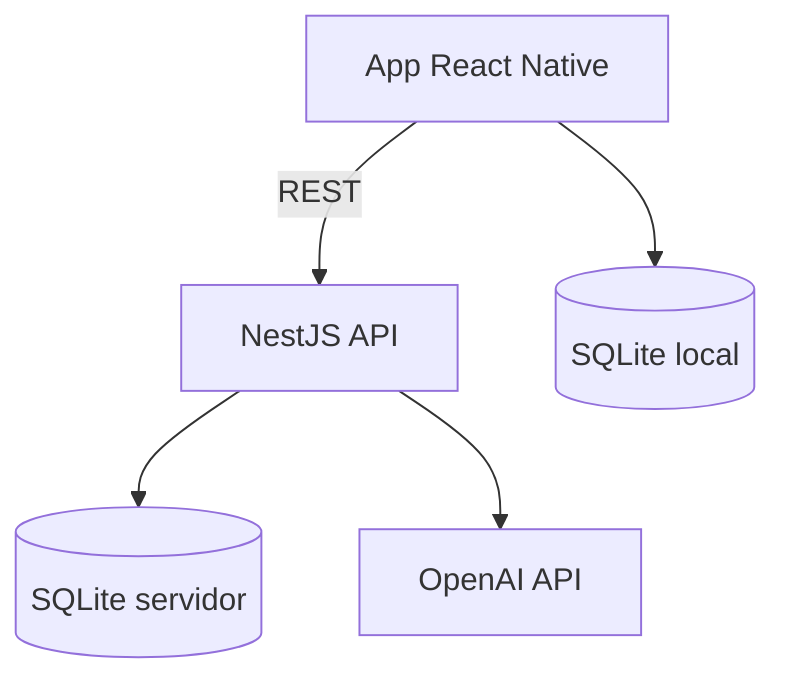
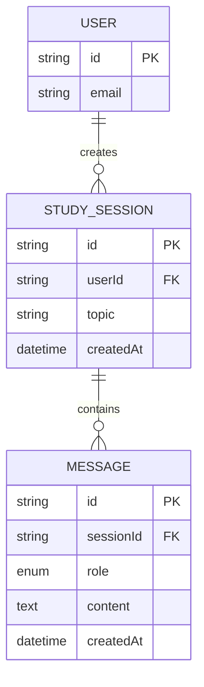

# TFM Architect — Ejemplo

Ejemplo abreviado: app de asistente de estudio con IA.

## Resumen ejecutivo

El TFM permite a estudiantes registrar preguntas y recibir respuestas generadas por OpenAI. Stack: React Native (cliente), NestJS (API), SQLite (persistencia), OpenAI API (generación).

## Requisitos (extracto)

| ID   | Requisito | Prioridad | Criterio de aceptación |
|------|-----------|-----------|------------------------|
| RF-01 | Crear sesión de estudio con tema | Must | Usuario define tema y ve sesión creada |
| RF-02 | Enviar pregunta y recibir respuesta IA | Must | Respuesta visible en < 10s (red normal) |
| RF-03 | Consultar historial de sesiones | Should | Lista ordenada por fecha descendente |
| RNF-01 | API key OpenAI no expuesta al cliente | Must | Key solo en variables de entorno del backend |
| RNF-02 | Consultar historial offline | Could | Últimas sesiones cacheadas en SQLite local |

## C4 — Contexto

## C4 — Contenedores

## Modelo de datos (extracto)

## ADR de ejemplo

### ADR-001: OpenAI solo desde backend

**Contexto**: RF-02 requiere IA; RNF-01 exige no exponer API keys.

**Decisión**: NestJS expone `POST /sessions/:id/messages`. El servicio `OpenAiService` encapsula llamadas. RN nunca conoce la key.

**Consecuencias**: Latencia adicional mínima; control centralizado de costes y prompts.

### ADR-002: SQLite en backend para MVP

**Contexto**: Un desarrollador, alcance académico limitado, sin requisito de alta concurrencia.

**Decisión**: SQLite en NestJS con better-sqlite3 o TypeORM. Migrar a PostgreSQL queda fuera del MVP (Won't).

**Consecuencias**: Setup simple; limitación de concurrencia escrita aceptable para demo.

## Riesgos

| Riesgo | Mitigación |
|--------|------------|
| Coste OpenAI impredecible | Límite de tokens por request; ADR de rate limiting |
| Respuestas incorrectas de IA | Disclaimer UI; RF de revisión humana opcional |
| Complejidad offline | RNF-02 como Could; cache read-only en MVP |
