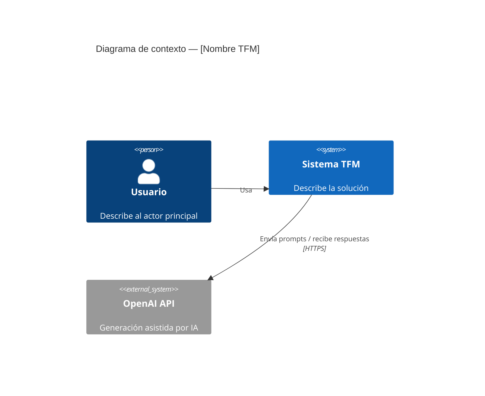
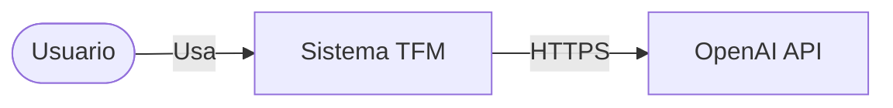
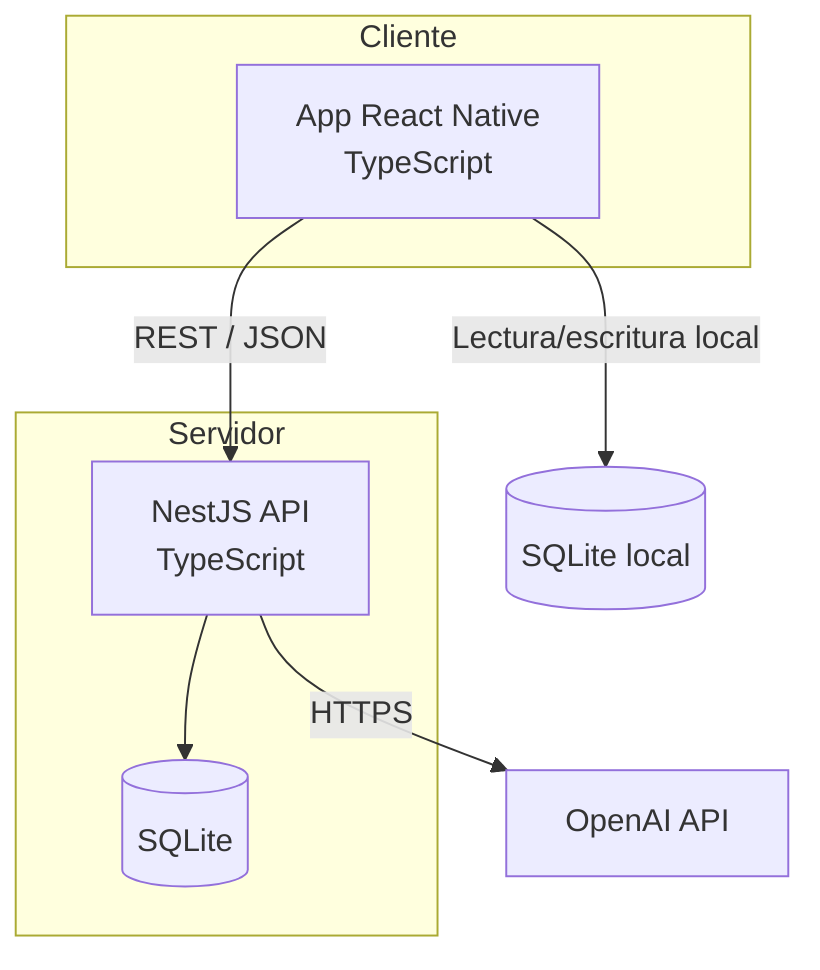
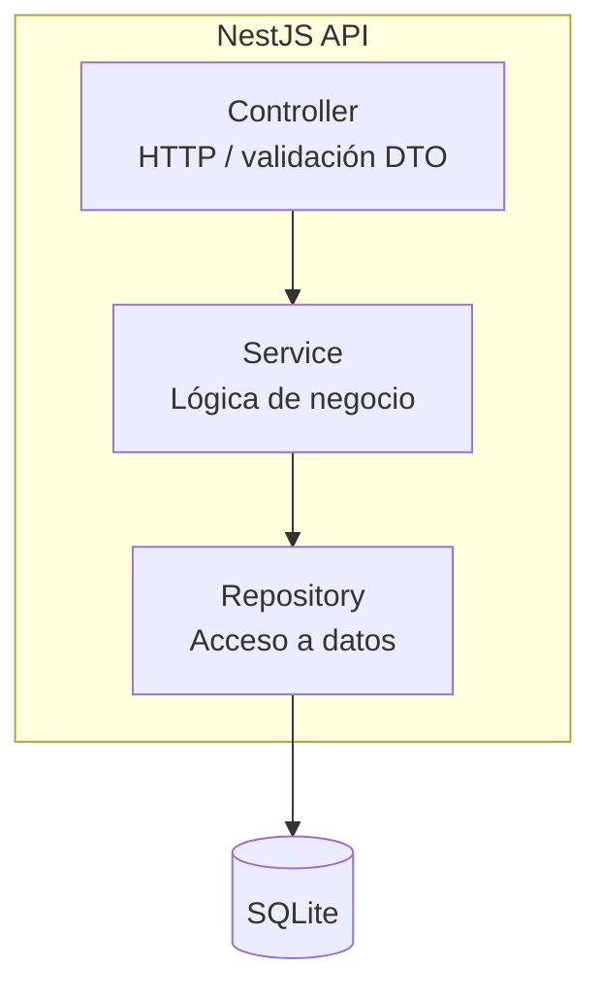
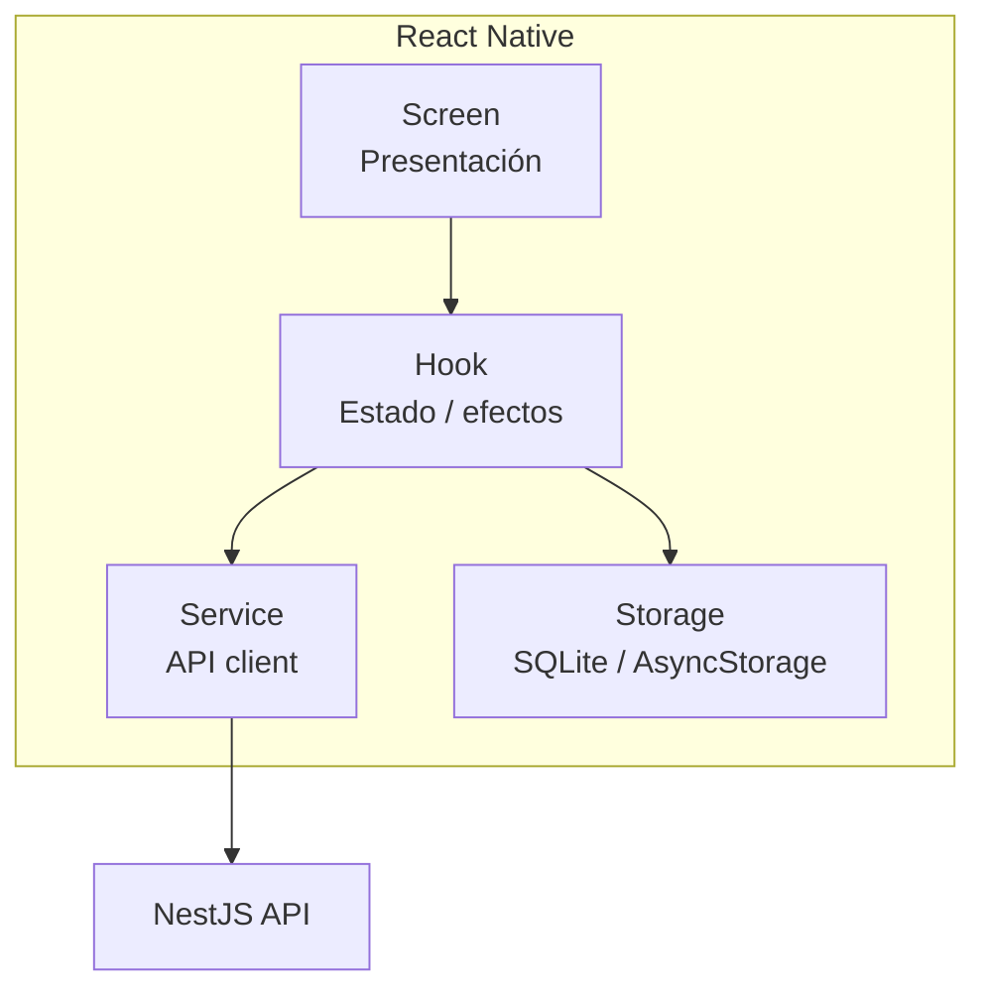
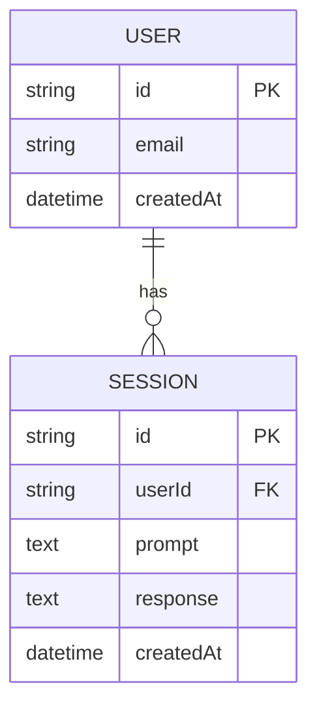

# TFM Architect — Referencia

## Requisitos

### Plantilla RF

```markdown
| ID   | Requisito | Prioridad | Criterio de aceptación |
|------|-----------|-----------|------------------------|
| RF-01 | El usuario puede ... | Must | Dado ... cuando ... entonces ... |
```

### Plantilla RNF

```markdown
| ID    | Categoría    | Requisito | Métrica / verificación |
|-------|--------------|-----------|------------------------|
| RNF-01 | Rendimiento | La API responde en < 500ms (p95) | Test de carga / logs |
| RNF-02 | Seguridad   | Tokens no persistidos en plain text | Revisión de código |
| RNF-03 | Offline     | Consulta de datos cacheados sin red | Test manual en modo avión |
| RNF-04 | Coste API   | Límite de tokens por sesión         | Config + monitoring |
```

Categorías RNF habituales: rendimiento, seguridad, usabilidad, mantenibilidad, escalabilidad, disponibilidad, privacidad (RGPD si aplica).

---

## Diagramas C4

Usar Mermaid. Mantener nombres en español si el TFM es en español.

### Nivel 1 — Contexto



Si Mermaid C4 no renderiza, usar flowchart equivalente:



### Nivel 2 — Contenedores



Anotar protocolos, formatos (JSON) y responsabilidad de cada contenedor.

### Nivel 3 — Componentes (NestJS)



### Nivel 3 — Componentes (React Native)



---

## Modelo de datos

### Plantilla de entidad

```markdown
### Entidad: [Nombre]

| Atributo   | Tipo TS     | Obligatorio | Descripción |
|------------|-------------|-------------|-------------|
| id         | string (UUID) | Sí        | Identificador único |
| createdAt  | Date        | Sí          | Timestamp creación |
```

### Diagrama ER (Mermaid)



### Convenciones

- Nombres de tabla/entidad: `PascalCase` en docs, `snake_case` en SQLite si se prefiere consistencia SQL.
- PK: UUID v4 o autoincrement según necesidad de offline sync.
- Timestamps: `createdAt`, `updatedAt` en entidades mutables.
- Soft delete solo si el dominio lo exige; preferir delete físico en MVP.
- DTOs NestJS separados de entities; no exponer entities directamente.

---

## ADR

### Plantilla

```markdown
# ADR-[NNN]: [Título breve]

## Estado
Propuesto | Aceptado | Deprecado | Sustituido por ADR-XXX

## Contexto
[Problema o necesidad que motiva la decisión]

## Opciones consideradas
1. **Opción A** — pros / contras
2. **Opción B** — pros / contras

## Decisión
[Opción elegida y justificación alineada con principios TFM]

## Consecuencias
- Positivas: ...
- Negativas / deuda: ...
- Riesgos: ...
```

### ADRs típicos en TFM RN + NestJS

| Tema | Decisiones comunes |
|------|-------------------|
| Persistencia | SQLite solo local vs backend vs ambos |
| Auth | JWT en SecureStore vs refresh tokens |
| OpenAI | Prompts en backend vs cliente; streaming; cache |
| Estado RN | Context + hooks vs Zustand (justificar si se añade) |
| Comunicación | REST vs WebSockets |
| ORM backend | TypeORM vs Prisma vs better-sqlite3 directo |
| Offline | Queue de sync vs read-only cache |

---

## Stack de referencia

| Capa | Tecnología | Rol |
|------|------------|-----|
| Mobile | React Native + TypeScript | UI, lógica cliente, cache local |
| Backend | NestJS + TypeScript | API REST, lógica servidor, integración OpenAI |
| BD | SQLite | Persistencia (local y/o servidor) |
| IA | OpenAI API | Funcionalidad inteligente del TFM |
| Transporte | HTTPS + JSON | Comunicación cliente-servidor |

No introducir tecnologías adicionales sin ADR que justifique la complejidad añadida.
